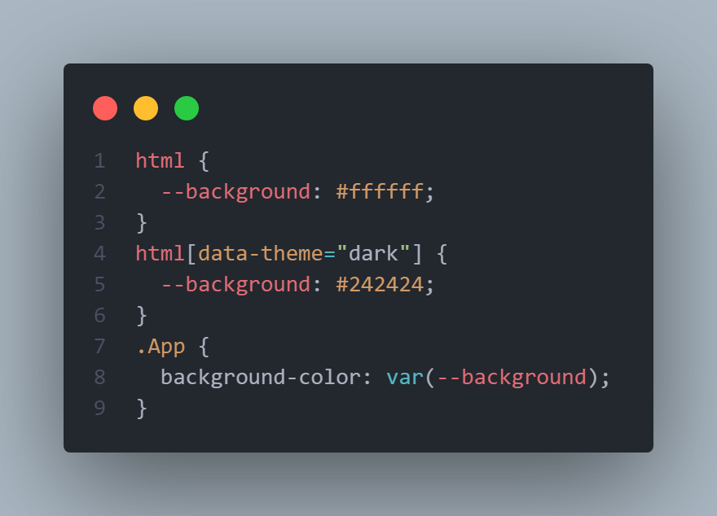
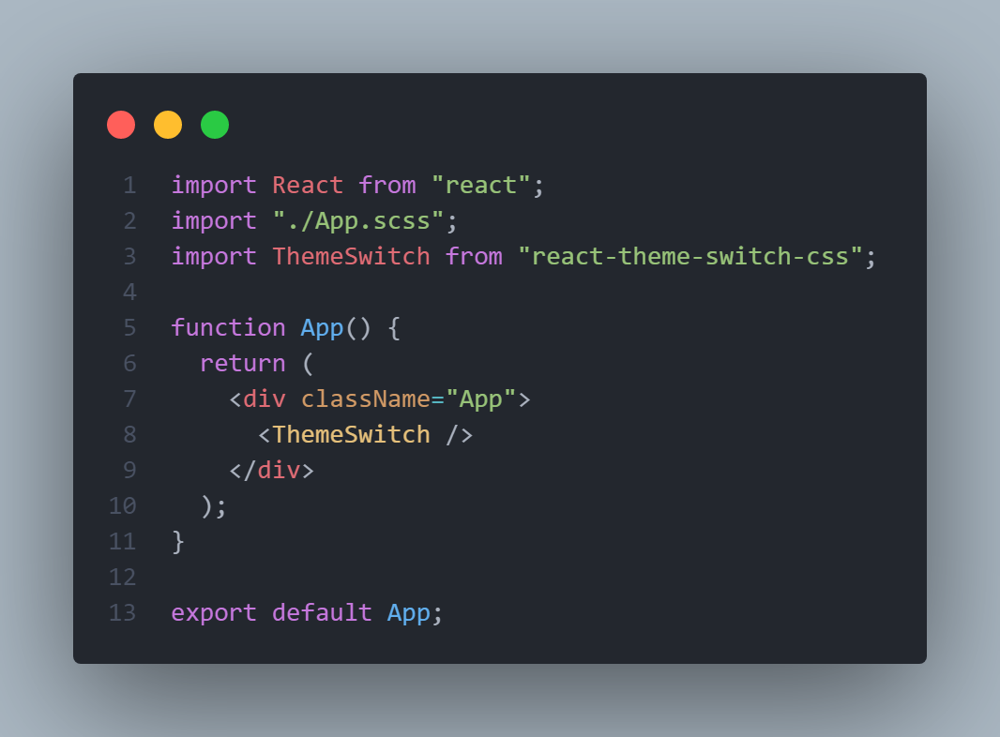

# react-theme-switch-css

A light / dark theme switcher based on css theme properties that respects user os preferences and stores user preference with the site

## Usage

## Usage

## Available Scripts

In the project directory, you can run:

### `npm start`

Runs the app in the development mode.\
Open [http://localhost:3000](http://localhost:3000) to view it in your browser.

This has a starter project using this package you can test it there

### `npm run build`

Builds the package for production to the `dist` folder.\
